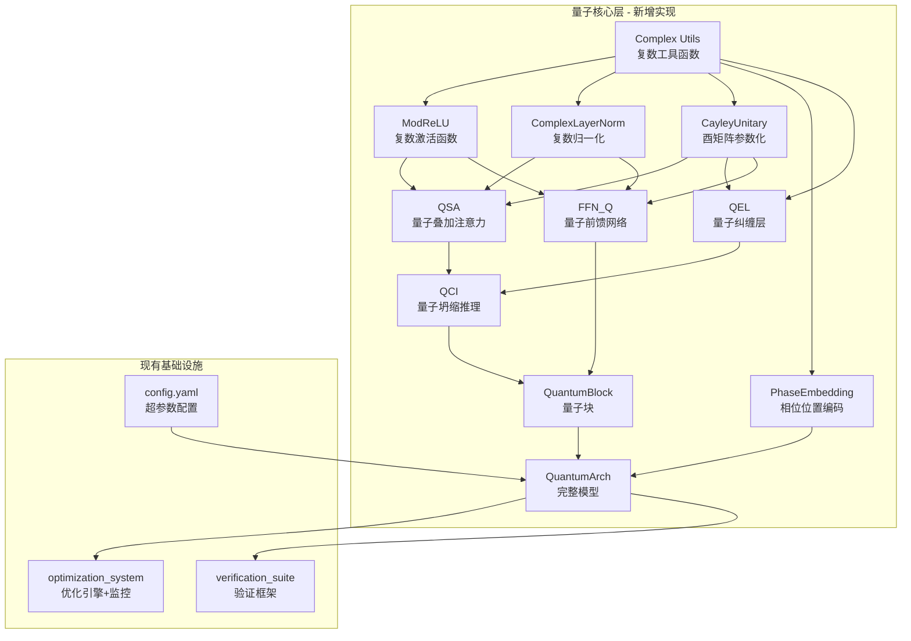

## 项目现状总结

量子架构 (QuantumArch) 是一个受量子力学启发的下一代 AI 计算范式，目标是复用量子力学的数学结构在经典计算平台上重新设计神经网络组件，超越 Transformer 架构。

### 已完成模块

- **理论设计文档 (95%)**：7 篇文档约 18 万字，覆盖核心概念(QSA/QEL/QCI/QIR/QGD/CR)、三层架构设计、自动化优化方案、工程挑战缓解、多领域纠缠扩展
- **自动化优化系统 (90%)**：optimization_system/ 下 4 个 Python 模块 + 1 个 YAML 配置，包含 9 个核心类的优化引擎、Prometheus 指标导出、训练管线
- **技术验证框架 (85%)**：verification_suite/test_framework.py，10 项测试覆盖复数运算、硬件利用、训练稳定性、理论验证
- **配置系统 (95%)**：471 行 YAML + 621 行 Python 配置

### 核心缺失（0% 完成）

- **六大核心机制的实际 PyTorch 实现**：QSA（量子叠加注意力）、QEL（量子纠缠层）、QCI（量子坍缩推理）、QIR（量子干涉路由）、QGD（量子梯度下降）、CR（复数表示/Cayley 参数化）
- **基础构建块**：ModReLU 复数激活函数、ComplexBatchNorm、酉矩阵参数化层、复数 LayerNorm
- **量子块 (QB)**：将上述组件组装为完整的前向传播块
- **完整模型**：嵌入层 + 位置编码 + 多层 QB + 输出层
- **任何实际实验结果**

## 核心需求

实现 Phase 1 PoC（概念验证），用真实 PyTorch 复数运算替换当前的 MockQuantumArch，使项目从纯文档设计进入可运行的代码实现阶段。具体包括：

1. 实现复数运算基础层（ModReLU、ComplexBatchNorm、复数 LayerNorm、Cayley 参数化酉矩阵）
2. 实现 QSA 量子叠加注意力（复数内积 + Born 概率 + 干涉路由 + Top-K 筛选）
3. 实现 QEL 量子纠缠层（局部纠缠门 + QFT 全局纠缠 + 自适应纠缠强度）
4. 实现 QCI 量子坍缩推理（POVM 测量 + 自适应早退 + 不确定性量化）
5. 实现量子块 QB 和完整 QuantumArch 模型
6. 集成到现有训练管线，替换 MockQuantumArch
7. 运行验证框架确认核心性质通过

## 技术栈

- **深度学习框架**：Python + PyTorch (torch.cfloat 复数张量)
- **复数运算**：PyTorch 原生复数支持 + 自定义 CUDA Kernel（后续阶段）
- **优化器**：PyTorch AdamW + 自定义 QGD 优化器（Wirtinger 导数 + 模长/相位分离）
- **监控**：现有 optimization_system/（Prometheus 指标、Grafana 面板）
- **测试**：现有 verification_suite/ + 新增单元测试

## 实现策略

### 整体方法

采用**自底向上**的实现策略：先建立复数运算基础层 -> 实现单个量子核心组件 -> 组装量子块 -> 构建完整模型 -> 集成训练管线。每层实现后立即编写验证测试，确保数学性质正确。

### 关键技术决策

1. **复数参数化方式**：使用 PyTorch 的 `torch.cfloat` (complex64) 而非将实部虚部拆为两个 float 张量。虽然拆分方式在某些场景更灵活，但原生复数张量代码更接近理论公式，可读性更好，且 PyTorch 已对复数自动微分提供了基本支持。

2. **酉矩阵实现**：使用 Cayley 参数化 `W = (I + i/2*Omega)^{-1}(I - i/2*Omega)` 作为核心方法。Omega 为斜厄米矩阵（skew-Hermitian），在训练中自由优化，W 自动满足酉性。避免每次前向传播后手动 Gram-Schmidt 正交化。

3. **QSA 实现策略**：分两步——先实现完整的 O(n^2) 复数注意力作为 correctness baseline，再实现 QIR 干涉路由的 Top-K 筛选作为优化版本。两者可通过配置切换，便于对比验证。

4. **QCI 实现策略**：基于冯诺依曼熵的不确定性度量 + 阈值控制的早退机制。第一阶段使用固定阈值（tau_low=0.5, tau_high=1.5），后续由 CollapseThresholdLearner（已在优化系统中实现）动态调节。

5. **梯度处理**：PyTorch 对复数的自动微分使用共轭导数 `dL/d(conj(z))`，与 Wirtinger 导数兼容但形式不同。在 QGD 优化器中手动分离模长/相位的梯度更新，无需修改底层 autograd。

### 性能考量

- 第一阶段（PoC）优先保证正确性，复数运算开销可接受（设计文档目标 <3x 实数运算）
- Cayley 变换中的矩阵求逆使用 `torch.linalg.solve` 而非 `torch.linalg.inv`，数值稳定性更好
- QFT 使用 `torch.fft.fft` 原生实现，无需自定义 kernel
- Top-K 筛选使用 `torch.topk` + `torch.gather`，利用现有 GPU kernel

### 集成策略

- 新增 `quantum_core/` 模块，与 `optimization_system/` 平级
- 训练管线中的 `MockQuantumArch` 替换为 `quantum_core.QuantumArch`
- 保持与 `optimization_engine.py` 的 `PerformanceMetrics` 接口兼容
- 验证框架中的测试可直接引用新实现的复数组件

## 架构设计



## 目录结构

```
e:/量子架构/
├── quantum_core/                          # [NEW] 量子核心实现模块
│   ├── __init__.py                        # [NEW] 模块导出，暴露所有公共接口
│   ├── complex_ops.py                     # [NEW] 复数基础运算工具：模长/相位分离、复数归一化、冯诺依曼熵计算、Born 概率
│   ├── activations.py                     # [NEW] ModReLU 复数激活函数实现，含自定义 autograd（确保梯度正确性）
│   ├── normalization.py                   # [NEW] ComplexLayerNorm（复数 LayerNorm）、ComplexBatchNorm
│   ├── unitary.py                         # [NEW] Cayley 参数化酉矩阵层 CayleyLinear，自动保持酉性约束
│   ├── embedding.py                       # [NEW] 复数嵌入层 + 量子位置编码（酉旋转 RzRx）
│   ├── attention.py                       # [NEW] QSA 量子叠加注意力（完整版 + Top-K 优化版），含多头支持
│   ├── entanglement.py                    # [NEW] QEL 量子纠缠层（局部纠缠门 + QFT 全局纠缠 + 自适应强度）
│   ├── collapse.py                        # [NEW] QCI 量子坍缩推理（POVM 测量算子 + 自适应早退 + 不确定性量化）
│   ├── ffn.py                             # [NEW] FFN_Q 量子前馈网络（复数 MLP + ModReLU + 门控机制 + 酉输出投影）
│   ├── quantum_block.py                   # [NEW] QuantumBlock 量子块（组装 QSA+QEL+FFN_Q+QCI，含 Pre-Norm）
│   ├── model.py                           # [NEW] QuantumArch 完整模型（嵌入 + 位置编码 + N 层 QB + 输出投影）
│   └── optimizer.py                       # [NEW] QGD 量子梯度下降优化器（Wirtinger 导数 + 模长/相位分离更新 + Cayley 投影）
├── tests/                                 # [NEW] 核心模块单元测试
│   ├── test_complex_ops.py                # [NEW] 复数运算正确性测试
│   ├── test_activations.py                # [NEW] ModReLU 梯度和数值正确性测试
│   ├── test_unitary.py                    # [NEW] 酉性约束测试（W†W=I 误差 < 1e-6）
│   ├── test_attention.py                  # [NEW] QSA 输出形状、概率归一化、梯度流测试
│   ├── test_entanglement.py               # [NEW] QEL 纠缠操作可逆性测试
│   ├── test_collapse.py                   # [NEW] QCI 坍缩早退逻辑测试
│   └── test_model.py                      # [NEW] 完整模型前向传播 + 梯度反传 + 配置切换测试
├── optimization_system/
│   └── training_pipeline.py               # [MODIFY] 替换 MockQuantumArch 为真实 QuantumArch，更新 forward 接口
├── verification_suite/
│   └── test_framework.py                  # [MODIFY] 引用真实复数组件替换内联实现，增加更多验证项
└── requirements.txt                       # [NEW] Python 依赖清单（torch, numpy, pynvml 等）
```

## 关键代码结构

### CayleyUnitary 核心接口

```python
class CayleyLinear(nn.Module):
    """Cayley 参数化酉矩阵线性层"""
    def __init__(self, in_features: int, out_features: int):
        # Omega 为斜厄米矩阵的自由参数，存储为 (in_features, out_features) 的复数张量
    
    def forward(self, x: torch.Tensor) -> torch.Tensor:
        # W = (I + i/2*Omega)^{-1} (I - i/2*Omega)
        # output = x @ W
        return output
    
    @property
    def unitary_matrix(self) -> torch.Tensor:
        # 返回当前的酉矩阵 W，用于酉约束检查
        return W
```

### QSA 核心接口

```python
class QuantumSuperpositionAttention(nn.Module):
    """量子叠加注意力"""
    def __init__(self, dim: int, num_heads: int, topk_ratio: float = 0.1):
        # Wq, Wk, Wv: 复数投影矩阵 (CayleyLinear)
        # phase_fn: 可学习相位函数（干涉路由）
    
    def forward(self, x: torch.Tensor) -> Tuple[torch.Tensor, Dict[str, torch.Tensor]]:
        # 返回: (output, metrics_dict)
        # metrics_dict 包含: attention_entropy, topk_ratio_actual, interference_score
        ...
```

### QuantumBlock 核心接口

```python
class QuantumBlock(nn.Module):
    """量子块 - 量子架构的基本构建单元"""
    def __init__(self, dim: int, num_heads: int, ffn_dim: int,
                 topk_ratio: float, collapse_enabled: bool):
        self.norm1 = ComplexLayerNorm(dim)
        self.qsa = QuantumSuperpositionAttention(dim, num_heads, topk_ratio)
        self.qel = QuantumEntanglementLayer(dim)
        self.norm2 = ComplexLayerNorm(dim)
        self.ffn_q = QuantumFFN(dim, ffn_dim)
        self.qci = QuantumCollapseInference(dim) if collapse_enabled else None
    
    def forward(self, x: torch.Tensor) -> Tuple[torch.Tensor, Dict]:
        # Pre-Norm -> QSA -> QEL -> Pre-Norm -> FFN_Q -> 可选 Collapse
        # 返回: (output, layer_metrics)
```

## 实现注意事项

### Grounded 实践

- `training_pipeline.py` 中 MockQuantumArch 暴露的接口（`forward` 返回 + `qsa_topk_ratio` 等属性）需要在新模型中保持兼容
- `config.yaml` 中的超参数键名（`qsa.adaptive.topk_ratio`, `qci.collapse.tau_low` 等）应直接在新模型初始化中使用
- `PerformanceMetrics` 的字段名（`qsa_computation_time`, `qci_early_exit_rate` 等）决定了新模型 forward 必须返回的 metrics 字典格式

### 性能

- Cayley 变换的矩阵求逆是潜在瓶颈：当矩阵维度 > 1024 时考虑用 `torch.linalg.solve` 替代 `inv`，或引入 Neumann 级数近似
- QFT 使用 `torch.fft.fft`，已经是 O(n log n)，无需额外优化
- Top-K 筛选的 `k = topk_ratio * n` 在变长序列下需动态计算

### Blast Radius Control

- 新增 `quantum_core/` 为独立模块，不修改现有 `optimization_system/` 的核心逻辑
- 训练管线修改仅限于替换模型实例化部分，优化引擎和指标导出代码不变
- 保留 MockQuantumArch 代码（重命名为 `MockQuantumArchLegacy`），通过配置切换新旧模型，确保回退能力

此任务为纯后端/算法实现，不涉及 UI 设计。

## Agent Extensions

### SubAgent

- **code-explorer**
- Purpose: 在实现过程中搜索和验证设计文档中的数学公式、算法伪代码，确保实现与理论一致
- Expected outcome: 快速定位设计文档中的具体定义，减少手动翻阅文档的时间