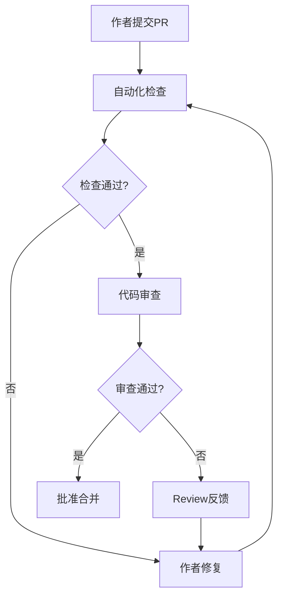

# 代码质量提升体系

**团队技术能力提升框架** - QuantumArch 项目专属

---

## 📋 目录

1. [体系概览](#体系概览)
2. [代码规范](#代码规范)
3. [代码审查流程](#代码审查流程)
4. [质量度量工具](#质量度量工具)
5. [架构优化指南](#架构优化指南)
6. [性能优化实践](#性能优化实践)
7. [知识沉淀机制](#知识沉淀机制)

---

## 体系概览

### 目标

建立从**代码编写** → **审查** → **度量** → **优化** → **沉淀**的闭环质量提升体系,确保团队技术持续进步。

### 核心支柱

```
┌─────────────────────────────────────────────────────────────┐
│                    代码质量提升体系                          │
├─────────────────────────────────────────────────────────────┤
│                                                             │
│  ┌──────────────┐    ┌──────────────┐    ┌──────────────┐ │
│  │  代码规范    │───▶│  审查流程    │───▶│  质量度量    │ │
│  │  (编写标准)  │    │  (质量控制)  │    │  (自动化)    │ │
│  └──────────────┘    └──────────────┘    └──────────────┘ │
│         │                    │                    │        │
│         └────────────────────┴────────────────────┘        │
│                           │                                 │
│                    ┌──────▼──────┐                         │
│                    │ 持续优化循环 │                         │
│                    └─────────────┘                         │
│                           │                                 │
│                    ┌──────▼──────┐                         │
│                    │  知识沉淀    │                         │
│                    │  (最佳实践)  │                         │
│                    └─────────────┘                         │
└─────────────────────────────────────────────────────────────┘
```

---

## 代码规范

### Python/PyTorch 规范

#### 命名约定

```python
# ✅ 推荐
class QuantumSuperpositionAttention(nn.Module):  # 类名: PascalCase
def compute_born_probability(state):              # 函数名: snake_case
qsa_topk_ratio = 0.1                             # 变量名: snake_case
MAX_ENTANGLEMENT_STRENGTH = 1.0                  # 常量: UPPER_SNAKE_CASE

# ❌ 避免
class quantumSuperpositionAttention:              # 错误命名风格
def ComputeBornProbability(state):                # 错误命名风格
QSA_Topk_Ratio = 0.1                             # 混合风格
```

#### 类型注解

```python
# ✅ 推荐 - 完整类型注解
from typing import Dict, Optional, Tuple, Union

def forward(
    self,
    x: torch.Tensor,
    training: bool = True,
) -> Tuple[torch.Tensor, Dict[str, float]]:
    """前向传播函数。

    Args:
        x: 输入张量 (batch, seq_len, dim)
        training: 是否训练模式

    Returns:
        (output, metrics): 输出张量和指标字典
    """
    pass

# ❌ 避免 - 缺少类型注解
def forward(self, x, training=True):
    pass
```

#### 文档字符串

```python
# ✅ 推荐 - Google 风格 docstring
class QuantumEntanglementLayer(nn.Module):
    """量子纠缠层 (QEL) — 完整实现。

    对序列中的 token 建立量子纠缠关联:
    1. 局部纠缠: 相邻 token 对通过参数化酉门耦合
    2. 全局纠缠: QFT 在序列维度建立长程关联
    3. 酉耦合融合: 用 U_couple 替代残差连接

    Args:
        dim: 特征维度
        use_adaptive: 是否使用自适应纠缠强度
        use_global_qft: 是否使用 QFT 全局纠缠
        coupling_type: 'full' 或 'diagonal'(酉耦合类型)

    Attributes:
        entangle_gate: 纠缠门模块
        qft: 全局 QFT 模块
        coupling: 酉耦合层

    Raises:
        ValueError: 当 coupling_type 不为 'full' 或 'diagonal'

    Examples:
        >>> qel = QuantumEntanglementLayer(dim=64, use_adaptive=True)
        >>> x = torch.randn(2, 16, 64, dtype=torch.complex64)
        >>> y, metrics = qel(x, training=True)
        >>> y.shape
        torch.Size([2, 16, 64])
    """

    pass

# ❌ 避免 - 文档不完整
class QuantumEntanglementLayer(nn.Module):
    """纠缠层。"""
    pass
```

#### 错误处理

```python
# ✅ 推荐 - 明确的异常处理和消息
def unitary_matrix(self) -> torch.Tensor:
    """返回酉矩阵表示。

    Returns:
        酉矩阵张量 (d, d)

    Raises:
        RuntimeError: 当 Cayley 变换计算失败时
    """
    try:
        I = torch.eye(self.out_dim, dtype=self.A.dtype, device=self.A.device)
        Omega = self._skew_symmetric(self.A)
        W = torch.linalg.inv(I + 1j * Omega / 2) @ (I - 1j * Omega / 2)
        return W
    except Exception as e:
        raise RuntimeError(f"Cayley 变换计算失败: {e}") from e

# ❌ 避免 - 静默失败
def unitary_matrix(self) -> torch.Tensor:
    try:
        I = torch.eye(self.out_dim, dtype=self.A.dtype, device=self.A.device)
        Omega = self._skew_symmetric(self.A)
        return torch.linalg.inv(I + 1j * Omega / 2) @ (I - 1j * Omega / 2)
    except:
        return torch.eye(self.out_dim)  # 静默返回错误结果
```

#### PyTorch 特定规范

```python
# ✅ 推荐 - 正确的设备/类型处理
class CayleyLinear(nn.Module):
    def __init__(self, in_dim: int, out_dim: int, init_scale: float = 0.02):
        super().__init__()
        self.in_dim = in_dim
        self.out_dim = out_dim

        # 初始化参数
        self.A = nn.Parameter(torch.randn(in_dim, out_dim) * init_scale)

    def forward(self, x: torch.Tensor) -> torch.Tensor:
        # 自动设备对齐
        if x.device != self.A.device:
            self.A = self.A.to(x.device)

        # 类型转换
        if x.dtype != torch.complex64:
            x = x.to(torch.complex64)

        W = self.unitary_matrix.to(x.device)
        return x @ W

# ❌ 避免 - 硬编码设备
def forward(self, x: torch.Tensor) -> torch.Tensor:
    W = self.unitary_matrix  # 可能在错误的设备上
    return x @ W  # 可能导致运行时错误
```

---

## 代码审查流程

### Review Checklist

#### 功能正确性

- [ ] **数学正确性**: 复数运算、酉矩阵、Born 概率等量子公式是否正确
- [ ] **边界条件**: 空输入、零除、极大值等边界情况是否处理
- [ ] **梯度流**: 所有可学习参数是否有梯度传播
- [ ] **数值稳定性**: 是否避免了 NaN/Inf 溢出

#### 代码质量

- [ ] **命名**: 变量、函数、类名清晰表达意图
- [ ] **类型注解**: 所有公开 API 都有完整的类型注解
- [ ] **文档字符串**: 每个模块、类、重要函数都有 docstring
- [ ] **代码复用**: 避免重复代码,抽取公共逻辑

#### 性能考虑

- [ ] **复杂度**: 时间/空间复杂度是否合理
- [ ] **内存泄漏**: 是否有不必要的张量缓存
- [ ] **向量化**: 是否充分利用 PyTorch 向量操作
- [ ] **GPU 利用**: 是否避免不必要的 CPU-GPU 同步

#### 测试覆盖

- [ ] **单元测试**: 新功能是否对应测试用例
- [ ] **集成测试**: 是否验证端到端流程
- [ ] **性能测试**: 是否有基准测试
- [ ] **文档示例**: docstring 中的示例代码是否可运行

#### QuantumArch 特定

- [ ] **酉性约束**: Cayley 参数化是否正确实现
- [ ] **复数运算**: 是否正确处理实部/虚部、模长/相位
- [ ] **量子性质**: Born 归一化、干涉效应是否正确
- [ ] **维度对齐**: 张量维度在所有操作中是否一致

### Review 流程



### Review 模板

```markdown
## 代码审查: [PR标题]

### 总体评价
- [ ] 批准
- [ ] 需要修改
- [ ] 需要重大调整

### 功能性
- [ ] 数学正确性
- [ ] 逻辑完整性
- [ ] 边界条件处理

### 代码质量
- [ ] 命名规范
- [ ] 类型注解
- [ ] 文档完整
- [ ] 代码复用

### 性能
- [ ] 算法复杂度
- [ ] 内存使用
- [ ] GPU 利用

### 测试
- [ ] 单元测试覆盖
- [ ] 集成测试
- [ ] 性能基准

### QuantumArch 特定
- [ ] 酉性约束正确
- [ ] 复数运算规范
- [ ] 量子性质验证

### 具体建议

#### 🔴 必须修改

#### 🟡 建议修改

#### 🟢 可选改进

### 其他备注
```

---

## 质量度量工具

### Linting 配置

创建 `.flake8` 文件:

```ini
[flake8]
max-line-length = 100
ignore = E203, E266, E501, W503
exclude =
    .git,
    __pycache__,
    build,
    dist,
    *.egg-info,
    .venv,
    venv
per-file-ignores =
    __init__.py:F401
```

创建 `.pylintrc` 文件:

```ini
[MASTER]
extension-pkg-whitelist=pytorch

[FORMAT]
indent-string='    '
max-line-length=100

[MESSAGES CONTROL]
disable=
    C0103,  # invalid-name (允许某些简化命名)
    C0114,  # missing-module-docstring
    R0902,  # too-many-instance-attributes
    R0903,  # too-few-public-methods
    R0913,  # too-many-arguments
    W0212,  # protected-access

[DESIGN]
max-args=7
max-locals=15
max-returns=6
```

### Type Checking

创建 `pyproject.toml`:

```toml
[tool.pyright]
include = ["quantum_core", "tests"]
exclude = ["**/__pycache__", "**/node_modules"]
reportMissingImports = true
reportMissingTypeStubs = false
reportOptionalMemberAccess = "warning"
pythonVersion = "3.9"
pythonPlatform = "Linux"
typeCheckingMode = "basic"  # 对 PyTorch 使用 basic 模式
```

### 自动化测试

创建 `pytest.ini`:

```ini
[pytest]
testpaths = tests
python_files = test_*.py
python_classes = Test*
python_functions = test_*
addopts =
    -v
    --strict-markers
    --tb=short
    --cov=quantum_core
    --cov-report=html
    --cov-report=term-missing
markers =
    slow: marks tests as slow
    integration: marks tests as integration tests
    unit: marks tests as unit tests
```

### CI/CD 集成

创建 `.github/workflows/quality.yml`:

```yaml
name: 代码质量检查

on:
  pull_request:
    branches: [ main, dev ]
  push:
    branches: [ main, dev ]

jobs:
  lint:
    runs-on: ubuntu-latest
    steps:
    - uses: actions/checkout@v3
    - name: 设置 Python
      uses: actions/setup-python@v4
      with:
        python-version: '3.9'
    - name: 安装依赖
      run: |
        pip install flake8 pylint pyright pytest pytest-cov
    - name: Flake8 检查
      run: flake8 quantum_core tests
    - name: Pylint 检查
      run: pylint quantum_core --exit-zero
    - name: Type checking
      run: pyright

  test:
    runs-on: ubuntu-latest
    steps:
    - uses: actions/checkout@v3
    - name: 设置 Python
      uses: actions/setup-python@v4
      with:
        python-version: '3.9'
    - name: 安装依赖
      run: |
        pip install torch>=2.0.0 pytest pytest-cov
    - name: 运行测试
      run: pytest tests/ -v --cov=quantum_core --cov-report=xml
    - name: 上传覆盖率
      uses: codecov/codecov-action@v3
      with:
        files: ./coverage.xml
```

---

## 架构优化指南

### QuantumArch 架构建议

#### 1. 模块解耦

**当前问题**: 部分模块耦合度较高

**优化方案**:

```python
# ✅ 推荐 - 接口抽象
from abc import ABC, abstractmethod

class QuantumOperator(ABC):
    """量子算子基类。"""

    @abstractmethod
    def forward(
        self,
        x: torch.Tensor,
        training: bool = True
    ) -> Tuple[torch.Tensor, Dict[str, Any]]:
        """前向传播。

        Args:
            x: 输入张量 (batch, seq_len, dim)
            training: 是否训练模式

        Returns:
            (output, metrics): 输出和度量字典
        """
        pass

    @abstractmethod
    def get_unitarity_report(self) -> Dict[str, float]:
        """返回酉性约束报告。"""
        pass

# 所有核心模块继承此基类
class QuantumSuperpositionAttention(QuantumOperator):
    pass

class QuantumEntanglementLayer(QuantumOperator):
    pass
```

#### 2. 配置管理

**当前问题**: 参数硬编码,难以调整

**优化方案**:

```python
# config.py - 集中配置管理
from dataclasses import dataclass
from typing import Optional

@dataclass
class QuantumArchConfig:
    """QuantumArch 配置类。"""
    # 模型结构
    dim: int = 512
    num_layers: int = 6
    num_heads: int = 8
    ffn_dim: Optional[int] = None

    # QSA 参数
    qsa_mode: str = 'topk'
    topk_ratio: float = 0.1

    # QCI 参数
    collapse_enabled: bool = True
    tau_low: float = 0.5
    tau_high: float = 1.5

    # QEL 参数
    use_adaptive_entanglement: bool = True
    use_global_qft: bool = True
    qft_steps: int = 1

    # 训练参数
    dropout: float = 0.0
    learning_rate: float = 1e-4

    def validate(self) -> None:
        """验证配置合法性。"""
        if self.dim % self.num_heads != 0:
            raise ValueError(f"dim ({self.dim}) 必须能被 num_heads ({self.num_heads}) 整除")

        if not 0 <= self.topk_ratio <= 1:
            raise ValueError(f"topk_ratio 必须在 [0, 1] 范围内")

        if self.tau_low >= self.tau_high:
            raise ValueError(f"tau_low ({self.tau_low}) 必须小于 tau_high ({self.tau_high})")

# 使用配置
config = QuantumArchConfig(dim=512, num_layers=6)
config.validate()
model = QuantumArch(**dataclasses.asdict(config))
```

#### 3. 梯度检查点

**优化方案**:

```python
# ✅ 推荐 - 内存优化
class QuantumBlock(nn.Module):
    def __init__(self, *args, use_checkpoint: bool = False, **kwargs):
        super().__init__()
        self.use_checkpoint = use_checkpoint
        # ... 初始化其他组件

    def forward(self, x: torch.Tensor, training: bool = True) -> Tuple[torch.Tensor, Dict]:
        if self.use_checkpoint and training:
            return torch.utils.checkpoint.checkpoint(self._forward, x, training)
        else:
            return self._forward(x, training)

    def _forward(self, x: torch.Tensor, training: bool) -> Tuple[torch.Tensor, Dict]:
        # 实际前向逻辑
        pass
```

#### 4. 参数初始化策略

**优化方案**:

```python
# ✅ 推荐 - 自定义初始化器
def quantum_init_(
    weight: torch.Tensor,
    scale: float = 0.02,
    distribution: str = 'normal'
) -> None:
    """量子权重初始化。

    Args:
        weight: 权重张量
        scale: 初始缩放因子
        distribution: 分布类型 ('normal' 或 'uniform')
    """
    if distribution == 'normal':
        if weight.is_complex():
            nn.init.normal_(weight.real, std=scale)
            nn.init.normal_(weight.imag, std=scale)
        else:
            nn.init.normal_(weight, std=scale)
    elif distribution == 'uniform':
        if weight.is_complex():
            nn.init.uniform_(weight.real, -scale, scale)
            nn.init.uniform_(weight.imag, -scale, scale)
        else:
            nn.init.uniform_(weight, -scale, scale)

# 使用
class CayleyLinear(nn.Module):
    def __init__(self, in_dim, out_dim, init_scale=0.02):
        super().__init__()
        self.A = nn.Parameter(torch.empty(in_dim, out_dim))
        quantum_init_(self.A, scale=init_scale)
```

---

## 性能优化实践

### 1. CUDA 优化

#### 自定义 CUDA Kernel (示例)

```python
# quantum_core/kernels/complex_ops.cu
#include <torch/extension.h>

// 复数模长计算 CUDA kernel
__global__ void complex_abs_kernel(
    const at::complex<float>* input,
    float* output,
    int64_t size
) {
    const int idx = blockIdx.x * blockDim.x + threadIdx.x;
    if (idx < size) {
        at::complex<float> z = input[idx];
        output[idx] = sqrtf(z.real() * z.real() + z.imag() * z.imag());
    }
}

// Python 绑定
torch::Tensor complex_abs_cuda(torch::Tensor input) {
    auto output = torch::empty(input.sizes(), input.options().dtype(torch::kFloat32));
    const int64_t size = input.numel();

    const int threads = 256;
    const int blocks = (size + threads - 1) / threads;

    complex_abs_kernel<<<blocks, threads>>>(
        reinterpret_cast<at::complex<float>*>(input.data_ptr()),
        output.data_ptr<float>(),
        size
    );

    return output;
}
```

### 2. 混合精度训练

```python
# ✅ 推荐 - 混合精度训练
from torch.cuda.amp import autocast, GradScaler

def train_mixed_precision(
    model: nn.Module,
    optimizer: QGD,
    dataloader: DataLoader,
    epochs: int = 10
):
    """使用混合精度训练。"""
    scaler = GradScaler()

    for epoch in range(epochs):
        model.train()
        for batch in dataloader:
            optimizer.zero_grad()

            # 自动混合精度
            with autocast():
                result = model({'inputs': batch['x']}, training=True)
                loss = compute_loss(result, batch['target'])

            # 反向传播
            scaler.scale(loss).backward()
            scaler.step(optimizer)
            scaler.update()
```

### 3. 内存优化

```python
# ✅ 推荐 - 内存高效实现
class MemoryEfficientQSA(nn.Module):
    """内存高效的 QSA 实现。"""

    def forward(self, x: torch.Tensor) -> torch.Tensor:
        B, N, D = x.shape

        # 分批计算注意力,避免 O(N²) 内存
        chunk_size = 256
        outputs = []

        for i in range(0, N, chunk_size):
            chunk = x[:, i:i+chunk_size, :]

            # 计算当前 chunk 的注意力
            q = self.Wq(chunk)
            k = self.Wk(x)
            v = self.Wv(x)

            # 注意力分数 (chunk_size, N)
            scores = (q @ k.transpose(-2, -1)) / math.sqrt(D)

            # Top-K 筛选
            topk_scores, topk_indices = scores.topk(k=int(N * self.topk_ratio), dim=-1)

            # 加权聚合
            weights = torch.softmax(topk_scores, dim=-1)
            chunk_output = weights @ v.gather(1, topk_indices.unsqueeze(-1).expand(-1, -1, D))

            outputs.append(chunk_output)

        return torch.cat(outputs, dim=1)
```

### 4. 性能分析工具

```python
# profiling.py
import torch.profiler as profiler

def profile_model(model: nn.Module, input_shape: tuple):
    """性能分析。"""
    inputs = torch.randn(*input_shape, dtype=torch.complex64).cuda()

    with profiler.profile(
        activities=[profiler.ProfilerActivity.CPU, profiler.ProfilerActivity.CUDA],
        record_shapes=True,
        profile_memory=True
    ) as prof:
        model({'inputs': inputs}, training=True)

    # 打印分析结果
    print(prof.key_averages().table(sort_by="cuda_time_total"))

    # 导出到 Chrome Trace
    prof.export_chrome_trace("trace.json")
```

---

## 知识沉淀机制

### 1. 技术文档体系

```
docs/
├── design/              # 设计文档
│   ├── architecture.md  # 架构设计
│   ├── api_design.md    # API 设计
│   └── optimization.md  # 优化策略
├── guides/              # 指南文档
│   ├── getting_started.md
│   ├── advanced_topics.md
│   └── performance_tuning.md
├── references/          # 参考资料
│   ├── quantum_mechanics.md
│   └── pytorch_patterns.md
└── experiments/         # 实验记录
    ├── baselines/
    └── ablation_studies/
```

### 2. 技术分享机制

#### 技术分享模板

```markdown
# 技术分享: [标题]

**日期**: 2026-03-21
**分享人**: [姓名]
**主题**: [核心技术点]

---

## 背景介绍

[为什么需要这次技术分享? 当前面临什么问题?]

---

## 核心内容

### 1. [子主题1]

[技术要点、代码示例、图示]

### 2. [子主题2]

[技术要点、代码示例、图示]

---

## 实践案例

[实际应用中的案例、遇到的问题、解决方案]

---

## Q&A

[讨论问题和解答]

---

## 参考资源

- [链接1]
- [链接2]

---

## 行动项

- [ ] [具体行动1]
- [ ] [具体行动2]
```

### 3. 最佳实践库

创建 `examples/best_practices/`:

```python
# examples/best_practices/unitary_preservation.py
"""
酉性保持的最佳实践。

关键点:
1. 使用 Cayley 参数化保证严格的酉性
2. 定期检查酉性违背度
3. 在训练监控中加入酉性指标
"""

from quantum_core import CayleyLinear, check_unitarity

# ✅ 最佳实践: Cayley 参数化
def create_unitary_layer(dim: int) -> CayleyLinear:
    """创建酉矩阵层。"""
    layer = CayleyLinear(dim, dim, init_scale=0.02)

    # 验证初始酉性
    violation = layer.get_unitarity_violation().item()
    assert violation < 1e-4, f"初始酉性违背过大: {violation:.2e}"

    return layer

# ✅ 最佳实践: 训练中监控酉性
def train_with_unitarity_monitoring(
    model: nn.Module,
    optimizer,
    epochs: int
):
    """训练并监控酉性约束。"""
    for epoch in range(epochs):
        # ... 训练逻辑

        # 每个 epoch 检查酉性
        report = model.get_unitarity_report()
        max_violation = max(report.values())

        if max_violation > 0.01:
            print(f"警告: 酉性违背过大 ({max_violation:.4f})")
```

### 4. 代码审查知识库

创建 `.github/PULL_REQUEST_TEMPLATE.md`:

```markdown
## 变更说明

[简要描述本次变更的目的和范围]

---

## 变更类型

- [ ] 新功能
- [ ] Bug 修复
- [ ] 性能优化
- [ ] 重构
- [ ] 文档更新
- [ ] 测试

---

## 测试情况

- [ ] 单元测试通过
- [ ] 集成测试通过
- [ ] 性能基准测试
- [ ] 手动测试通过

---

## QuantumArch 特定检查

- [ ] 酋性约束保持 (violation < 1e-3)
- [ ] 复数运算正确性
- [ ] 梯度流完整
- [ ] 数值稳定性

---

## 相关文档

- [ ] 文档已更新
- [ ] API 变更已说明
- [ ] 迁移指南(如有)

---

## Checklist

- [ ] 代码符合项目规范
- [ ] 所有测试通过
- [ ] 代码已通过 lint 检查
- [ ] 类型检查通过
- [ ] 文档已更新
```

---

## 持续改进计划

### 短期目标 (1-3 个月)

1. ✅ 建立代码规范文档
2. ✅ 配置自动化质量检查
3. ✅ 建立 code review 流程
4. ⏳ 完成性能优化指南

### 中期目标 (3-6 个月)

1. ⏳ 建立性能基准测试
2. ⏳ 完善技术文档体系
3. ⏳ 建立技术分享机制
4. ⏳ 最佳实践库建设

### 长期目标 (6-12 个月)

1. ⏳ 自动化测试覆盖率 > 90%
2. ⏳ 建立知识图谱
3. ⏳ 团队技术能力认证体系
4. ⏳ 开源社区最佳实践

---

## 附录

### A. 工具安装

```bash
# Linting 工具
pip install flake8 pylint black isort

# Type checking
pip install pyright mypy

# 测试工具
pip install pytest pytest-cov pytest-benchmark

# 性能分析
pip install torch-tb-profiler
```

### B. IDE 配置

#### VSCode 配置 (`.vscode/settings.json`)

```json
{
    "python.linting.enabled": true,
    "python.linting.flake8Enabled": true,
    "python.linting.pylintEnabled": true,
    "python.formatting.provider": "black",
    "python.linting.mypyEnabled": true,
    "editor.formatOnSave": true,
    "python.analysis.typeCheckingMode": "basic"
}
```

---

**版本**: v1.0
**维护**: 量子架构项目组
**更新**: 2026-03-21
