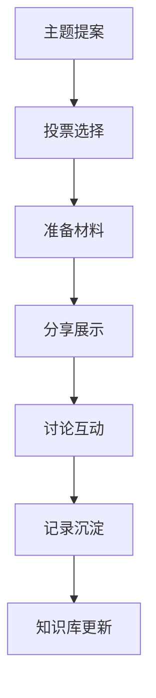

# QuantumArch 知识沉淀与技术分享体系

**构建团队技术资产,促进知识传承与创新**

---

## 目录

1. [知识库体系架构](#知识库体系架构)
2. [技术文档标准](#技术文档标准)
3. [技术分享机制](#技术分享机制)
4. [最佳实践库](#最佳实践库)
5. [问题排查手册](#问题排查手册)
6. [技术成长路径](#技术成长路径)

---

## 知识库体系架构

### 知识库结构

```
knowledge_base/
├── 01_fundamentals/          # 基础知识
│   ├── quantum_mechanics.md  # 量子力学基础
│   ├── complex_analysis.md   # 复数分析
│   └── pytorch_patterns.md   # PyTorch 编程模式
│
├── 02_architecture/          # 架构设计
│   ├── quantum_arch_design.md # QuantumArch 设计哲学
│   ├── component_design.md   # 组件设计原则
│   └── performance_patterns.md # 性能设计模式
│
├── 03_implementation/        # 实现细节
│   ├── unitary_matrices.md   # 酉矩阵实现
│   ├── attention_mechanisms.md # 注意力机制
│   ├── entanglement_ops.md   # 纠缠操作
│   └── collapse_inference.md # 坍缩推理
│
├── 04_optimization/          # 优化技术
│   ├── cuda_optimization.md  # CUDA 优化
│   ├── mixed_precision.md    # 混合精度
│   ├── memory_optimization.md # 内存优化
│   └── distributed_training.md # 分布式训练
│
├── 05_troubleshooting/       # 问题排查
│   ├── common_issues.md      # 常见问题
│   ├── debugging_guide.md    # 调试指南
│   └── performance_issues.md # 性能问题
│
├── 06_best_practices/        # 最佳实践
│   ├── code_quality.md       # 代码质量
│   ├── testing_strategies.md # 测试策略
│   └── deployment.md         # 部署实践
│
├── 07_research_notes/        # 研究笔记
│   ├── paper_reviews.md      # 论文阅读笔记
│   ├── experiment_records.md # 实验记录
│   └── future_directions.md  # 未来方向
│
└── 08_team_knowledge/        # 团队知识
    ├── onboarding/           # 新人入职
    ├── skills_matrix.md      # 技能矩阵
    └── learning_paths.md     # 学习路径
```

### 知识分类标签

每个文档应包含以下元数据标签:

```markdown
---
title: 文档标题
category: 基础知识 | 架构设计 | 实现细节 | 优化技术 | 问题排查 | 最佳实践
tags: [标签1, 标签2, ...]
difficulty: 入门 | 中级 | 高级
estimated_time: 30分钟
last_updated: 2026-03-21
maintainer: [维护者姓名]
related: [相关文档路径]
---
```

---

## 技术文档标准

### 文档模板

```markdown
# [文档标题]

**文档元数据**

- **类别**: [类别]
- **难度**: [难度等级]
- **预计阅读时间**: [时间]
- **最后更新**: [日期]
- **维护者**: [姓名]

---

## 概述

[简要说明文档的目的和涵盖内容]

---

## 背景知识

[必要的背景知识介绍]

---

## 核心概念

### 概念1

**定义**

[概念的定义]

**数学表达**

[数学公式]

**代码实现**

```python
# 代码示例
def example_function():
    pass
```

**应用场景**

[什么时候使用这个概念]

---

### 概念2

[同上结构]

---

## 实践指南

### 步骤1: [步骤名称]

**目标**: [步骤目标]

**操作**: [具体操作步骤]

```python
# 操作代码示例
```

**注意事项**: [注意事项]

---

### 步骤2: [步骤名称]

[同上结构]

---

## 示例代码

### 完整示例

```python
"""
完整的可运行示例。
"""

# 示例代码
# ...

# 运行结果
# Expected output: ...
```

---

## 常见问题

### Q1: [问题描述]

**A**: [解答]

### Q2: [问题描述]

**A**: [解答]

---

## 参考资料

- [资料1](链接)
- [资料2](链接)

---

## 附录

### 术语表

| 术语 | 英文 | 说明 |
|------|------|------|
| 术语1 | Term1 | 说明 |
| 术语2 | Term2 | 说明 |

---

**文档版本**: v1.0
**变更历史**:
- v1.0 (2026-03-21): 初始版本
```

---

## 技术分享机制

### 分享类型与流程

#### 1. 技术分享会

**频率**: 每两周一次

**流程**:



**模板**:

```markdown
# 技术分享: [主题]

**日期**: 2026-03-21
**分享人**: [姓名]
**主题分类**: [架构/实现/优化/研究]

---

## 分享背景

- **问题**: 什么问题驱动了这次分享?
- **动机**: 为什么需要解决这个问题?
- **影响**: 这个问题对团队/项目有什么影响?

---

## 核心内容

### 1. [子主题1]

#### 背景
[背景说明]

#### 方案
[方案描述]

#### 实现
```python
# 关键代码
```

#### 效果
- [效果1]
- [效果2]

---

### 2. [子主题2]

[同上结构]

---

## 演示

[现场演示或录屏]

---

## 讨论

### 提问1
**提问**: [问题]
**回答**: [解答]

### 提问2
**提问**: [问题]
**回答**: [解答]

---

## 行动项

- [ ] [行动1] ([责任人], [截止日期])
- [ ] [行动2] ([责任人], [截止日期])

---

## 参考资源

- [链接1]
- [链接2]

---

**反馈评价**:
- 内容清晰度: ⭐⭐⭐⭐⭐
- 技术深度: ⭐⭐⭐⭐⭐
- 实用价值: ⭐⭐⭐⭐⭐
```

#### 2. 代码审查会 (Code Review)

**频率**: 每周一次

**目的**:
- 集体 review 重要 PR
- 讨论架构决策
- 分享代码最佳实践

#### 3. 技术调研报告

**流程**:

1. **选题** → 团队投票选择调研主题
2. **调研** → 深入研究,收集资料
3. **报告** → 撰写技术报告
4. **分享** → 技术分享会展示
5. **沉淀** → 整理到知识库

**模板**:

```markdown
# 技术调研: [主题]

**调研人**: [姓名]
**调研周期**: [开始日期] - [结束日期]

---

## 调研目标

[明确调研的目标和范围]

---

## 背景

[为什么需要这次调研]

---

## 技术方案分析

### 方案1: [方案名称]

**优势**:
- [优势1]
- [优势2]

**劣势**:
- [劣势1]
- [劣势2]

**适用场景**:
- [场景1]
- [场景2]

**实现复杂度**: 低/中/高

**性能影响**: [量化描述]

---

### 方案2: [方案名称]

[同上结构]

---

## 对比分析

| 维度 | 方案1 | 方案2 | 方案3 |
|------|-------|-------|-------|
| 实现复杂度 | 低 | 中 | 高 |
| 性能 | 好 | 很好 | 最好 |
| 维护性 | 高 | 中 | 低 |

---

## 推荐方案

**推荐**: [方案名称]

**理由**:
1. [理由1]
2. [理由2]

**实施计划**:
- [ ] 步骤1
- [ ] 步骤2

---

## 参考资料

- [论文/文档1](链接)
- [开源项目1](链接)
- [博客/教程1](链接)

---

## 附录

### 关键代码片段

```python
# 方案的关键实现
```

### 实验数据

[对比实验数据]

---

**评审意见**:
- [评审人1]: [意见]
- [评审人2]: [意见]
```

---

## 最佳实践库

### 实践分类

#### 1. 代码模式 (Code Patterns)

```python
# knowledge_base/06_best_practices/code_patterns/unitary_preservation.md

"""
酉性保持的最佳实践

关键原则:
1. 使用 Cayley 参数化保证严格酉性
2. 定期监控酉性违背度
3. 在训练循环中加入酉性检查
4. 记录酉性随训练的变化趋势
"""

# ✅ 最佳实践: Cayley 参数化
def create_unitary_layer(dim: int) -> CayleyLinear:
    """创建酉矩阵层。"""
    layer = CayleyLinear(dim, dim, init_scale=0.02)

    # 初始验证
    violation = layer.get_unitarity_violation().item()
    assert violation < 1e-4, f"初始酉性违背过大: {violation:.2e}"

    return layer


# ✅ 最佳实践: 训练监控
def train_with_unitarity_monitoring(
    model: nn.Module,
    optimizer,
    dataloader,
    epochs: int
):
    """训练并监控酉性约束。"""
    unitarity_history = []

    for epoch in range(epochs):
        for batch in dataloader:
            # ... 训练步骤

        # 每个 epoch 检查酉性
        report = model.get_unitarity_report()
        max_violation = max(report.values())
        unitarity_history.append(max_violation)

        if max_violation > 0.01:
            print(f"警告: 酉性违背过大 ({max_violation:.4f})")

    return unitarity_history
```

#### 2. 性能优化 (Performance Optimization)

```python
# knowledge_base/06_best_practices/performance/attention_optimization.md

"""
注意力机制优化实践

优化策略:
1. 使用 FlashAttention (如果可用)
2. 实现 Top-K 注意力减少计算量
3. 梯度检查点节省内存
4. 混合精度加速计算
"""

# ✅ 最佳实践: Top-K 注意力
class TopKAttention(nn.Module):
    """Top-K 注意力实现。"""

    def __init__(self, dim: int, num_heads: int, topk_ratio: float = 0.1):
        super().__init__()
        self.dim = dim
        self.num_heads = num_heads
        self.head_dim = dim // num_heads
        self.topk_ratio = topk_ratio

        self.Wq = nn.Linear(dim, dim, bias=False)
        self.Wk = nn.Linear(dim, dim, bias=False)
        self.Wv = nn.Linear(dim, dim, bias=False)
        self.Wo = nn.Linear(dim, dim, bias=False)

    def forward(self, x: torch.Tensor) -> torch.Tensor:
        B, N, D = x.shape

        # 投影
        q = self.Wq(x).reshape(B, N, self.num_heads, self.head_dim)
        k = self.Wk(x).reshape(B, N, self.num_heads, self.head_dim)
        v = self.Wv(x).reshape(B, N, self.num_heads, self.head_dim)

        # 注意力分数
        scores = torch.einsum('bhqd,bhkd->bhqk', q, k) / math.sqrt(self.head_dim)

        # Top-K 筛选
        k = int(N * self.topk_ratio)
        topk_scores, topk_indices = scores.topk(k, dim=-1)

        # 注意力权重
        weights = torch.softmax(topk_scores, dim=-1)

        # 加权聚合
        values = v.gather(2, topk_indices.unsqueeze(-1).expand(-1, -1, -1, self.head_dim))
        output = torch.einsum('bhqk,bhqd->bhqd', weights, values)

        # 输出投影
        output = output.reshape(B, N, D)
        return self.Wo(output)
```

#### 3. 测试策略 (Testing Strategies)

```python
# knowledge_base/06_best_practices/testing/property_based_testing.md

"""
基于属性的测试实践

对于量子架构的复数运算,使用属性化测试比单纯用例更有效。

关键属性:
1. 酉性: U^† U = I
2. 模长保持: ||Ux|| = ||x||
3. Born 归一化: sum(P) = 1
4. 相位连续性: 连续输入产生连续输出
"""

# ✅ 最佳实践: 属性化测试
import hypothesis.strategies as st
from hypothesis import given, settings

@given(
    st.lists(
        st.complex_numbers(min_magnitude=0, max_magnitude=10),
        min_size=10,
        max_size=100
    )
)
@settings(max_examples=1000)
def test_unitarity_preservation(vector):
    """测试酉变换保持向量长度。"""
    import numpy as np

    # 创建酉矩阵
    A = np.random.randn(len(vector), len(vector))
    Q, _ = np.linalg.qr(A)

    # 应用变换
    transformed = Q @ np.array(vector)

    # 验证: 模长保持
    assert np.allclose(
        np.linalg.norm(transformed),
        np.linalg.norm(vector),
        atol=1e-5
    )


@given(
    st.lists(
        st.complex_numbers(min_magnitude=0, max_magnitude=10),
        min_size=10,
        max_size=100
    )
)
@settings(max_examples=1000)
def test_born_normalization(vector):
    """测试 Born 归一化。"""
    import torch

    z = torch.tensor(vector, dtype=torch.complex64)
    probs = born_normalize(z, dim=-1)

    # 验证: 概率和为 1
    assert torch.allclose(probs.sum(dim=-1), torch.ones(1), atol=1e-5)

    # 验证: 概率非负
    assert (probs >= 0).all()
```

---

## 问题排查手册

### 问题分类与排查流程

#### 1. 数值问题 (Numerical Issues)

```markdown
### 症状: NaN 或 Inf

**可能原因**:
1. 学习率过大
2. 梯度爆炸
3. 数值不稳定的操作 (如除以接近0的数)
4. 损失函数数值溢出

**排查步骤**:

1. 检查损失值
```python
loss = compute_loss(output, target)
if not torch.isfinite(loss):
    print("损失函数值为 NaN 或 Inf!")
    # 检查中间输出
    print(f"Output min/max: {output.min()}, {output.max()}")
    print(f"Target min/max: {target.min()}, {target.max()}")
```

2. 检查梯度
```python
loss.backward()
for name, param in model.named_parameters():
    if param.grad is not None:
        if torch.isnan(param.grad).any() or torch.isinf(param.grad).any():
            print(f"参数 {name} 的梯度异常!")
            print(f"梯度统计: mean={param.grad.mean()}, std={param.grad.std()}")
```

3. 检查酉性违背
```python
report = model.get_unitarity_report()
for name, violation in report.items():
    if violation > 0.1:
        print(f"参数 {name} 的酉性违背过大: {violation:.4f}")
```

**解决方案**:

1. 降低学习率
```python
optimizer = QGD(model.parameters(), lr=1e-5)  # 从 1e-4 降到 1e-5
```

2. 添加梯度裁剪
```python
torch.nn.utils.clip_grad_norm_(model.parameters(), max_norm=1.0)
```

3. 使用混合精度训练
```python
from torch.cuda.amp import autocast, GradScaler

scaler = GradScaler()
with autocast():
    output = model({'inputs': x}, training=True)
    loss = compute_loss(output, target)

scaler.scale(loss).backward()
scaler.step(optimizer)
scaler.update()
```

4. 添加数值稳定性检查
```python
def safe_divide(a, b, eps=1e-8):
    """安全的除法操作。"""
    return a / (b + eps)
```

---

### 症状: 训练损失不下降

**可能原因**:
1. 学习率过小或过大
2. 梯度消失
3. 网络结构问题
4. 数据问题

**排查步骤**:

1. 检查梯度量级
```python
grad_norms = []
for param in model.parameters():
    if param.grad is not None:
        grad_norms.append(param.grad.norm().item())

avg_grad_norm = sum(grad_norms) / len(grad_norms)
print(f"平均梯度范数: {avg_grad_norm:.6f}")

if avg_grad_norm < 1e-7:
    print("警告: 梯度过小,可能存在梯度消失")
elif avg_grad_norm > 10:
    print("警告: 梯度过大,可能存在梯度爆炸")
```

2. 检查参数更新量
```python
param_updates = []
old_params = {name: p.clone() for name, p in model.named_parameters()}

optimizer.step()

for name, param in model.named_parameters():
    old_param = old_params[name]
    update_norm = (param - old_param).norm().item()
    param_norm = param.norm().item()
    param_updates.append(update_norm / param_norm)

avg_update_ratio = sum(param_updates) / len(param_updates)
print(f"平均参数更新比例: {avg_update_ratio:.6f}")
```

**解决方案**:

1. 调整学习率
```python
# 如果梯度过小,增大学习率
optimizer = QGD(model.parameters(), lr=1e-3)

# 如果梯度过大,减小学习率
optimizer = QGD(model.parameters(), lr=1e-5)
```

2. 添加残差连接和归一化
```python
class QuantumBlock(nn.Module):
    def forward(self, x):
        # 前向传播
        out = self.qsa(x)
        out = self.qel(out)
        out = self.qci(out)
        out = self.ffn(out)

        # 残差连接
        out = out + x

        # 归一化
        out = self.norm(out)

        return out
```

3. 使用梯度累积
```python
accumulation_steps = 4

for i, batch in enumerate(dataloader):
    loss = compute_loss(model(batch))
    loss = loss / accumulation_steps
    loss.backward()

    if (i + 1) % accumulation_steps == 0:
        optimizer.step()
        optimizer.zero_grad()
```
```

#### 2. 性能问题 (Performance Issues)

```markdown
### 症状: GPU 利用率低

**可能原因**:
1. CPU-GPU 数据传输瓶颈
2. 大量小 kernel 启动
3. 内存访问模式不佳
4. 同步操作过多

**排查步骤**:

1. 使用 NVIDIA Nsight 监控
```bash
nsys profile python train.py
```

2. 使用 PyTorch Profiler
```python
with torch.profiler.profile(
    activities=[torch.profiler.ProfilerActivity.CPU,
                torch.profiler.ProfilerActivity.CUDA],
    record_shapes=True,
    profile_memory=True
) as prof:
    output = model({'inputs': x}, training=True)

print(prof.key_averages().table(sort_by="cuda_time_total", row_limit=10))
```

**解决方案**:

1. 使用 DataLoader 的 pin_memory 和 num_workers
```python
dataloader = DataLoader(
    dataset,
    batch_size=32,
    pin_memory=True,      # 加速 CPU-GPU 传输
    num_workers=4         # 多进程加载数据
)
```

2. 减少同步操作
```python
# ❌ 避免: 频繁的 .item() 和 .cpu()
for i in range(1000):
    loss = compute_loss(x)
    loss_item = loss.item()  # CPU-GPU 同步

# ✅ 推荐: 批量收集指标
losses = []
for i in range(1000):
    loss = compute_loss(x)
    losses.append(loss)  # 保留在 GPU

# 最后一次性获取
losses = [l.item() for l in losses]
```

3. 使用异步执行
```python
# 流水线执行
stream1 = torch.cuda.Stream()
stream2 = torch.cuda.Stream()

with torch.cuda.stream(stream1):
    output1 = model({'inputs': x1}, training=True)

with torch.cuda.stream(stream2):
    output2 = model({'inputs': x2}, training=True)
```

---

### 症状: 内存占用过高

**可能原因**:
1. Batch size 过大
2. 模型保存了不必要的中间结果
3. 复数张量占用 2x 内存
4. 梯度检查点未使用

**排查步骤**:

1. 监控内存使用
```python
def print_memory_usage():
    allocated = torch.cuda.memory_allocated() / 1024**3
    reserved = torch.cuda.memory_reserved() / 1024**3
    print(f"已分配: {allocated:.2f} GB, 已保留: {reserved:.2f} GB")

print_memory_usage()
```

**解决方案**:

1. 使用梯度检查点
```python
from torch.utils.checkpoint import checkpoint

def forward_with_checkpointing(x):
    out = checkpoint(self.qsa, x)
    out = checkpoint(self.qel, out)
    out = checkpoint(self.qci, out)
    out = checkpoint(self.ffn, out)
    return out
```

2. 及时释放不需要的变量
```python
# ❌ 避免: 保留大变量
output = model({'inputs': x})
metrics = compute_metrics(output)  # output 仍然保留

# ✅ 推荐: 及时释放
output = model({'inputs': x})
metrics = compute_metrics(output)
del output  # 释放内存
torch.cuda.empty_cache()
```

3. 使用混合精度
```python
from torch.cuda.amp import autocast

with autocast():
    output = model({'inputs': x})  # 使用 FP16,内存减半
```
```

---

## 技术成长路径

### 技能矩阵

#### 技能分类

| 技能领域 | 入门 | 进阶 | 专家 |
|---------|------|------|------|
| **量子力学基础** | 了解量子态、叠加、纠缠 | 理解 Born 法则、酉变换 | 能推导量子算法 |
| **复数分析** | 基本复数运算 | 复变函数理论 | 复数几何、共形映射 |
| **PyTorch** | 基础张量操作 | 自定义 CUDA kernel | PyTorch 源码级优化 |
| **深度学习** | 理解基础网络 | Transformer 架构 | 自定义架构设计 |
| **QuantumArch** | 使用模型 API | 修改核心组件 | 设计新机制 |

#### 技能评估标准

**入门 (Level 1)**:
- 能够使用 QuantumArch 进行推理和训练
- 理解 QSA、QEL、QCI 的基本概念
- 能够阅读和理解核心代码

**进阶 (Level 2)**:
- 能够修改和优化核心组件
- 理复数运算和酉矩阵的数学原理
- 能够定位和解决常见问题

**专家 (Level 3)**:
- 能够设计新的量子机制
- 能够进行性能优化和 CUDA 编程
- 能够指导团队技术方向

### 学习路径

#### 路径1: 算法工程师

**目标**: 深入理解 QuantumArch 的数学原理和算法设计

**学习顺序**:
1. 量子力学基础 (2周)
   - 量子态和薛定谔方程
   - 叠加原理和测量
   - 纠缠和非局域性

2. 复数分析 (2周)
   - 复数运算和欧拉公式
   - 复变函数和解析函数
   - 复数几何

3. QuantumArch 核心机制 (4周)
   - QSA 量子叠加注意力
   - QEL 量子纠缠层
   - QCI 量子坍缩推理

4. 高级主题 (持续)
   - 多领域纠缠
   - 联邦学习集成

**推荐资源**:
- 《量子力学导论》- Griffiths
- 《复变函数论》- Ahlfors
- QuantumArch 论文和文档

---

#### 路径2: 系统工程师

**目标**: 掌握高性能计算和系统优化

**学习顺序**:
1. PyTorch 深度 (2周)
   - 自动微分原理
   - 自定义函数和模块
   - 并行计算

2. CUDA 编程 (4周)
   - CUDA 基础
   - 内存管理
   - Kernel 优化

3. 性能优化 (3周)
   - 混合精度训练
   - 内存优化
   - 分布式训练

4. 生产部署 (持续)
   - 模型服务化
   - 监控和运维

**推荐资源**:
- 《Programming Massively Parallel Processors》
- CUDA 官方文档
- PyTorch 性能调优指南

---

#### 路径3: 研究工程师

**目标**: 推动 QuantumArch 的理论创新

**学习顺序**:
1. 机器学习理论 (3周)
   - 深度学习理论
   - 优化理论
   - 泛化理论

2. 量子计算基础 (3周)
   - 量子算法
   - 量子信息论
   - 量子机器学习

3. 学术研究 (持续)
   - 阅读前沿论文
   - 设计实验
   - 撰写论文

**推荐资源**:
- 《深度学习》- Goodfellow
- 《Quantum Computation and Quantum Information》- Nielsen & Chuang
- arXiv, ICML, NeurIPS 论文

---

### 团队技术分享计划

#### 季度技术分享主题

**Q1 (1-3月)**:
- QuantumArch 架构设计哲学
- 复数运算优化实践
- 代码审查技巧

**Q2 (4-6月)**:
- CUDA 编程入门
- 分布式训练策略
- 量子力学与 AI 的交叉

**Q3 (7-9月)**:
- 混合精度训练详解
- 性能分析与调优
- 论文阅读分享会

**Q4 (10-12月)**:
- 创新机制设计
- 开源贡献指南
- 团队技术回顾

---

**版本**: v1.0
**维护**: 量子架构项目组
**更新**: 2026-03-21
